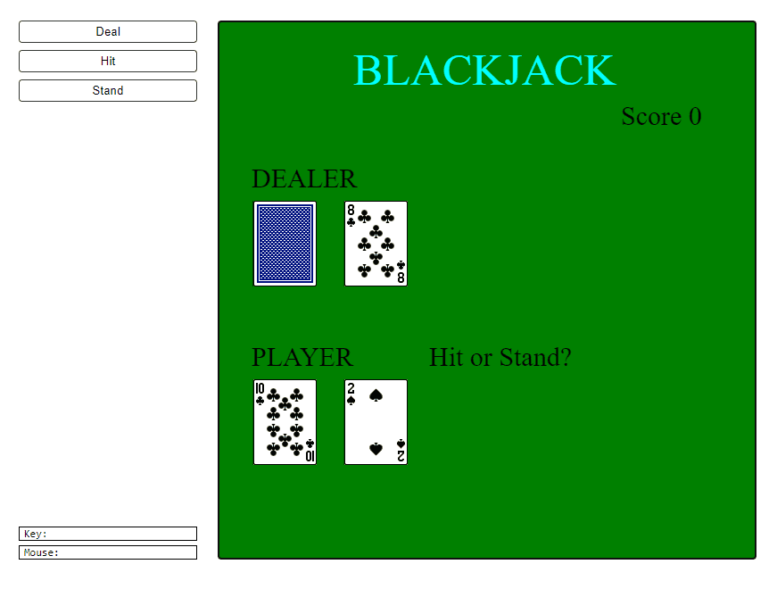

Blackjack: Test Your Luck and Strategy
======================================  

[Game Link](https://py2.codeskulptor.org/#user40_jnSBnwnpcO_20.py) Just click on the play button to launch the game.  

"Blackjack" is a captivating card game developed as part of Rice University's MOOC (Massive Open Online Course) titled "Introduction to Interactive Programming in Python." This Python-based game serves as the Week 6 project, allowing students to apply their newfound programming skills to create an engaging and interactive gaming experience.

## Key Features:

1. *Educational Excellence*: "Blackjack" stands as a testament to the knowledge and proficiency gained throughout the course, showcasing students' ability to implement complex logic and user interaction.

2. *Python-Powered*: Built entirely using Python, this game offers an opportunity for learners to apply programming concepts and principles in a practical context.

3. *Card-Game Excitement*: Enter the world of the casino with this digital version of the classic Blackjack card game. Test your luck and strategy as you aim to beat the dealer.

4. *SimpleGUI Magic*: Leveraging the SimpleGUI library from CodeSkulptor, the game provides an accessible and interactive user interface, enhancing the gaming experience.

5. *Skill and Luck*: "Blackjack" challenges players to make calculated decisions, manage their hand's value, and employ various strategies to outplay the dealer.

6. *Interactive Learning*: By exploring the game's code, students gain insights into game development, user input handling, and logical problem-solving within a Python environment.

"Blackjack" is not just a game; it's a showcase of programming prowess and an embodiment of practical learning in the world of Python and interactive software development. Whether you're a student completing the MOOC or a card-game enthusiast seeking a digital challenge, this project offers an educational and entertaining gaming experience. Take a seat at the virtual Blackjack table and test your luck and skill in this exciting adventure.  

  
